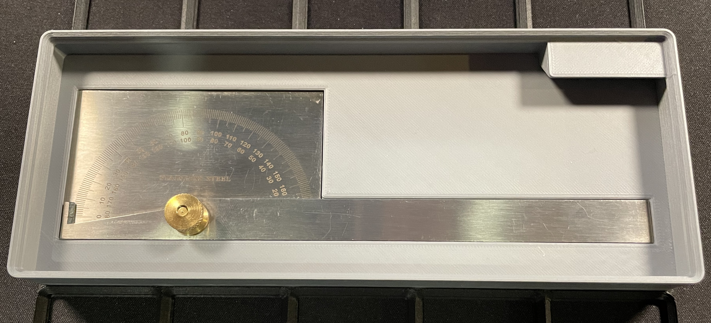

# Empire Protractor Gridfinity Holder

## Description
This is a **Gridfinity-compatible holder** for the **[Empire Level Protractor](https://www.empirelevel.com/specialty-measuring.php#collapse-27912)**.  
Designed to be **stackable** and **modular**, fitting seamlessly within a **5x2x3 Gridfinity footprint**.

### **Features**
- **M15 Center Threaded Hole** – Compatible with **Gridfinity Refined** and **Gridfinity Mix and Match** systems.
- **5.9mm Press Fit Magnet Holes** – Includes a **teardrop shape** for easy magnet removal using a pick.
- **Stackable Gridfinity Case** – Works with standard Gridfinity setups.

## Included Files
- **empire_protractor_gridfinity.stl** - Ready for 3D slicing.
- **empire_protractor_gridfinity.step** - Editable file for modifications.
- **empire_protractor_gridfinity.jpg** - Preview image.

## How I Sliced / Printed
- **Material:** Overture Matte PLA - Light Gray
- **Layer Height:** 0.2mm
- **Nozzle:** 0.4mm
- **Infill:** 15% Gyroid
- **Skirt and Brim:** Outer Brim Only - 5mm

## Attribution
This model was created using the **[Gridfinity Specification](https://www.printables.com/model/417152-gridfinity-specification)** and includes design elements for compatibility with **[Gridfinity Refined](https://www.printables.com/model/413761-gridfinity-refined)** and **[Gridfinity Mix and Match](https://www.printables.com/model/1172561-gridfinity-mix-and-match-baseplate-system)**:
- **[Gridfinity Specification](https://www.printables.com/model/417152-gridfinity-specification)** - Developed by [@grizzie17](https://www.printables.com/@grizzie17), used as the foundation for sizing and structure.
- **M15 Center Threaded Hole** - Designed for compatibility with **[Gridfinity Refined](https://www.printables.com/model/413761-gridfinity-refined)** by [@grizzie17](https://www.printables.com/@grizzie17) and **[Gridfinity Mix and Match](https://www.printables.com/model/1172561-gridfinity-mix-and-match-baseplate-system)** by [@pburt_30930](https://www.printables.com/@pburt_30930).

## License
This model is licensed under **[Creative Commons Attribution-ShareAlike 4.0](https://creativecommons.org/licenses/by-sa/4.0/)**.