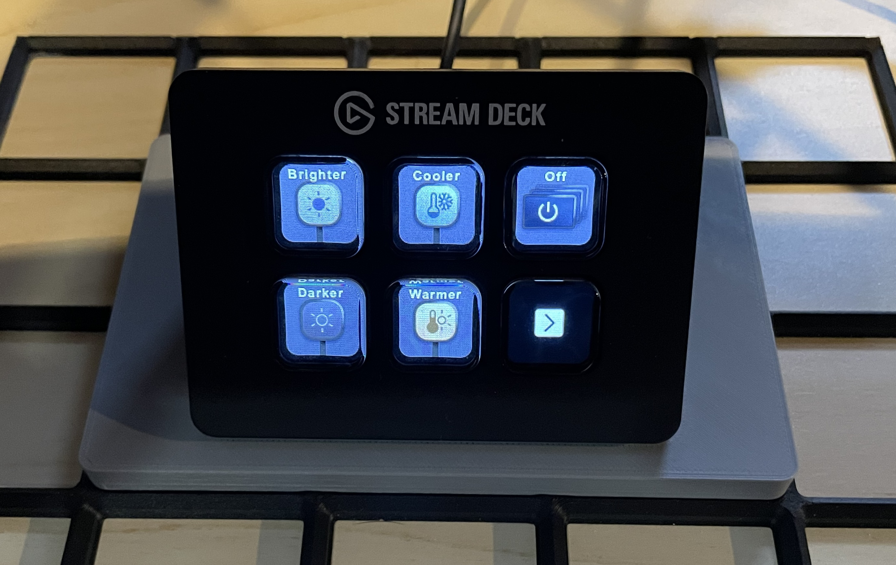

# Stream Deck Mini Gridfinity

## Description
This is a **Gridfinity-compatible tray** for the **[Elgato Stream Deck Mini](https://www.elgato.com/us/en/p/stream-deck-mini)**.  
Designed to fit seamlessly within a **3x2 Gridfinity footprint**. The Stream Deck Mini is just a tad bigger than 84mm wide.

### **Features**
- **M15 Center Threaded Hole** – Compatible with **Gridfinity Refined** and **Gridfinity Mix and Match** systems.
- **5.9mm Press Fit Magnet Holes** – Includes a **teardrop shape** for easy magnet removal using a pick.

## Included Files
- **stream_deck_mini_gridfinity.stl** - Ready for 3D slicing.
- **stream_deck_mini_gridfinity.step** - Editable file for modifications.
    - Includes a Stream Deck Mini-ish body (good enough for this tray but could use some refinements)
- **stream_deck_mini_gridfinity.jpg** - Preview image.

## How I Sliced / Printed
- **Slicer:** PrusaSlicer-2.9.0
- **Printer:** Prusa i3 MK3S+
- **Nozzle:** 0.4mm
- **Material:** Overture Matte PLA - Light Gray
- **Layers and perimeters:**
    - **Layer height:**
        - Layer height: 0.2mm
    - **Vertical shells:**
        - Perimeters: 3
    - **Horizontal shells:**
        - Solid layers:
            - Top: 3
            - Bottom: 3
- **Infill:**
    - **Infill:**
        - Fill density: 15%
        - Fill pattern: Gyroid
- **Skirt and brim:**
    - **Brim:**
        - Brim type: Outer Brim Only
        - Brim width: 5mm

## Attribution
This model was created using the **[Gridfinity Specification](https://www.printables.com/model/417152-gridfinity-specification)** and includes design elements for compatibility with **[Gridfinity Refined](https://www.printables.com/model/413761-gridfinity-refined)** and **[Gridfinity Mix and Match](https://www.printables.com/model/1172561-gridfinity-mix-and-match-baseplate-system)**:
- **[Gridfinity Specification](https://www.printables.com/model/417152-gridfinity-specification)** - Developed by [@grizzie17](https://www.printables.com/@grizzie17), used as the foundation for sizing and structure.
- **M15 Center Threaded Hole** - Designed for compatibility with **[Gridfinity Refined](https://www.printables.com/model/413761-gridfinity-refined)** by [@grizzie17](https://www.printables.com/@grizzie17) and **[Gridfinity Mix and Match](https://www.printables.com/model/1172561-gridfinity-mix-and-match-baseplate-system)** by [@pburt_30930](https://www.printables.com/@pburt_30930).

## License
This model is licensed under **[Creative Commons Attribution-ShareAlike 4.0](https://creativecommons.org/licenses/by-sa/4.0/)**.